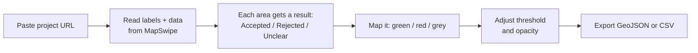

# MapSwipe Results Analyzer

See MapSwipe project results on a map and export the features you want. It runs as a single static
page in the browser and shows each project's own answer labels in place of the raw `0/1/2` codes.

## Run

Open `index.html` in a browser. If your browser blocks `fetch` from `file://`, serve the folder:

```sh
python3 -m http.server   # then open http://127.0.0.1:8000
```

Paste a project and click Add, for example:
`https://mapswipe.org/en/projects/01KW84AEFPQ0S9NCTN7TPMDN9X/`

## How it works



Each area is one MapSwipe task (here, an H3 hexagon). It is **Accepted** if more than your threshold
of mappers said yes, **Rejected** if more than your threshold said no, otherwise **Unclear**.

## Controls

| Control | What it does |
| --- | --- |
| Accept threshold | The share of mappers who must say yes for an area to count as accepted. |
| See-through grid | Fill opacity of the colored areas, so you can see imagery behind them. |
| results / imagery / AOI | Show or hide the result colors, the project's satellite imagery, and its area. |
| Download | Save accepted, rejected, or not-sure areas as GeoJSON, or all areas as CSV. |

## Terms

- **yes / no / not sure**: the answer options for the project, read from MapSwipe and shown by label.
- **AOI**: the project's area of interest.

## Sharing

The URL holds your projects, threshold, and opacity. Copy the address bar to share the exact view.
You can add more than one project.

## Where the data comes from (all read in the browser)

- `mapswipe.org` project page: project id and the results export URL.
- `msf-mapswipe.firebaseio.com`: the question, answer labels, colors, and tile server.
- `backend.mapswipe.org`: the aggregated results (votes per area).
